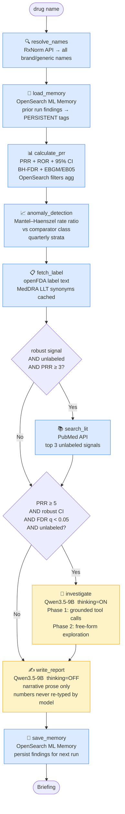
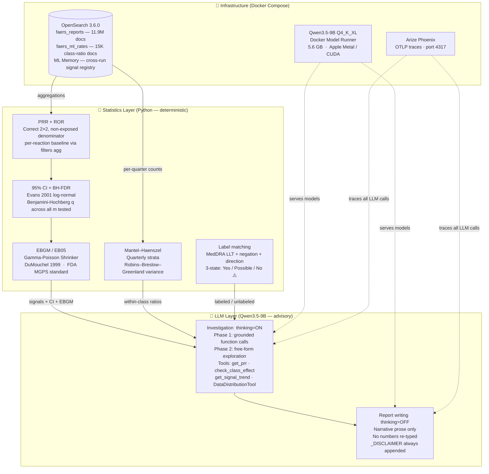

# Drug Safety Signal Agent — Local Edition

> Detect pharmacovigilance signals from FDA FAERS adverse event data.  
> Runs entirely on your laptop. No API keys. No cloud. No licenses.

```bash
git clone https://github.com/al-Zamakhshari/drug-safety-signal-agent
cd drug-safety-signal-agent
uv sync
docker compose up -d                    # pulls Qwen3.5-9B ~5.6GB on first run
./ingestion/download_faers.sh           # downloads FAERS 2018–2026 to ~/faers_data/
uv run python -m ingestion.faers_zip_indexer --dir ~/faers_data --all-drugs
uv run python -m ingestion.compute_class_ratio
uv run python -m ingestion.register_mcp_tools
uv run python -m app.server            # → http://localhost:8080
```

---

## What It Does

Detects drug safety signals from FDA FAERS adverse event reports using a fully local pipeline — no cloud services, no API keys, no licenses.

| Stage | Method | Technology |
|-------|--------|-----------|
| Signal detection | PRR + ROR + 95% CI + BH-FDR + EBGM/EB05 | OpenSearch aggregations |
| Within-class comparison | Mantel–Haenszel stratified rate ratio + CI | OpenSearch faers_ml_rates |
| Label cross-reference | MedDRA LLT-expanded, negation-aware token-overlap | openFDA API |
| Literature evidence | PubMed search | NCBI eUtils |
| Investigation | Two-phase function calling — class effect / trend / DDI | Qwen3.5-9B |
| Signal memory | Cross-run persistence | OpenSearch ML Memory (3.6+) |
| Web interface | Real-time streaming briefing | FastAPI + SSE |

**Example output — semaglutide, 82,699 reports, 11.9M baseline:**

```
### PRR + ROR + EBGM Signals (EMA/FDA standards)
| Reaction                  | PRR (95% CI)      | ROR (95% CI)      | EBGM / EB05 | χ²/CI/FDR | n     | Label? |
|---------------------------|-------------------|-------------------|-------------|-----------|-------|--------|
| IMPAIRED GASTRIC EMPTYING | 82.72 (79.8–85.7) | 85.86 (82.1–89.8) | 78.4 / 72.1 ✓| ✓✓✓    | 3,057 | Yes    |
| GLYCOSYLATED HB INCREASED | 11.54 (10.9–12.2) | 11.68 (11.0–12.4) | 11.2 / 10.8 ✓| ✓✓✓   | 1,111 | No ⚠️  |
| PANCREATITIS              | 10.38 (9.8–11.0)  | 10.55 (9.9–11.2)  | 9.9 / 9.4 ✓  | ✓✓✓   | 1,504 | Yes    |
| BLOOD GLUCOSE DECREASED   | 9.97 (9.4–10.6)   | 10.12 (9.5–10.8)  | 9.5 / 8.9 ✓  | ✓✓✓   | 1,311 | No ⚠️  |

Risk: HIGH  |  Action: ESCALATE
```

---

## Pipeline Flow



> **Blue nodes** = deterministic Python — same input always produces the same output.  
> **Yellow nodes** = Qwen3.5-9B — advisory, non-deterministic, clearly labelled in the briefing.

---

## Architecture



---

## Signal Detection Ladder

Every candidate signal climbs five rungs before triggering investigation. Each rung addresses a different failure mode of the previous one.

```mermaid
flowchart LR
    R0["FAERS reports\n(raw counts)"]

    R0 -->|n ≥ 3\neliminate\nsingle-event noise| R1

    R1["PRR / ROR\npoint estimate\n2×2 table"]

    R1 -->|Evans 2001\nlog-normal CI\nHaldane +0.5 for zero cells| R2

    R2["95% CI\nPRR lower > 1.0\n= robust gate\npenalises small n"]

    R2 -->|Yates χ²\nper-test p-value| R3

    R3["χ² significance\nannotation ✓/~\nnot a gate — surfaced\nfor human review"]

    R3 -->|Benjamini-Hochberg\nm = ALL reactions tested\nnot just PRR≥2| R4

    R4["BH q-value\n< 0.05 gate\nfamily-wise FDR\nacross ~50 reactions"]

    R4 -->|DuMouchel 1999\nGPS mixture prior\nfit across all drug reactions| R5

    R5["EBGM / EB05\nEB05 ≥ 2 = FDA flag\nshrinks PRR=15 at n=3\ndown to EB05~1.1"]

    R5 -->|All five passed| GATE{{"Investigation\ngate"}}

    GATE -->|unlabeled\nPRR ≥ 5| INV["🔬 LLM investigates"]
    GATE -->|all signals| TABLE["📊 Report table"]

    style GATE fill:#dcfce7,stroke:#16a34a
```



---

## Investigation Flow

For each strong unlabeled signal, Qwen3.5-9B runs two sequential phases:

```mermaid
flowchart TD
    SIG["Strong unlabeled signal\nPRR ≥ 5  ·  robust CI  ·  FDR q < 0.05"]
    SIG --> LOOP

    subgraph LOOP["Per-signal Python loop\none LLM call per reaction\nguarantees tool execution"]
        direction TB

        subgraph P1["Phase 1 — Grounded  (always runs)"]
            T1["① get_prr\n'Write: get_prr returned: paste exact JSON'\nprevents training-knowledge substitution"]
            T2["② check_class_effect\ncompare PRR vs 3 comparators\nidentify LOWEST comparator value"]
            T3["③ get_signal_trend\nquarterly timeline"]
            T1 --> T2 --> T3
            T3 --> C1{"drug PRR ÷\nLOWEST comparator\n> 5?"}
            C1 -->|Yes| DS["DRUG_SPECIFIC"]
            C1 -->|No|  CE["CLASS_EFFECT"]
        end

        DS & CE --> P2CHECK

        P2CHECK{"DRUG_SPECIFIC\nor ratio > 7?"}

        subgraph P2["Phase 2 — Free-form  (conditional)"]
            FT["Model chooses tools freely\nDataDistributionTool — time periods\nOpenSearch MCP — raw DSL queries\nget_prr — alternative name variants\ncheck_class_effect — other drug classes"]
        end

        P2CHECK -->|Yes| P2
        P2CHECK -->|No| OUT
        P2 --> OUT

        OUT["CLASSIFICATION  |  TREND  |  INSIGHT\nall grounded in tool-call results"]
    end
```

> **Why "paste exact JSON"?** Without explicit grounding, thinking models pre-reason about all signals during the `<think>` phase and skip actual tool calls for signals 2–3, substituting training knowledge for real FAERS data. Forcing the model to quote the raw JSON response makes tool execution mandatory and verifiable.

---

## Design Decisions & Rationale

### 1. Python owns all statistics; LLM only writes prose

The briefing table is rendered by Python — `write_report` passes pre-computed numbers as a JSON struct to the model, explicitly instructing it never to re-type them. The model's job is prose structure, not arithmetic.

**Why:** Language models hallucinate numbers, especially ratios and small-n statistics. A PRR of 82.72 must be *computed*, not narrated. The `_DISCLAIMER` on every briefing makes the LLM/Python boundary explicit to the reader.

---

### 2. Three estimators (PRR + ROR + EBGM) — each fixes a failure mode of the others

```
PRR alone:  correct formula, but PRR=15 on n=3 looks as confident as PRR=15 on n=3000
+ 95% CI:  lower bound penalises small n — PRR=15 on n=3 gets CI crossing 1.0 (not robust)
+ BH-FDR:  corrects for testing ~50 reactions simultaneously — controls false discovery rate
+ EBGM:    Bayesian shrinkage across all reactions — PRR=15 on n=3 → EB05=1.1 (not flagged)
           PRR=15 on n=3000 → EB05=14.5 (correctly flagged)
```

The EBGM is the FDA MGPS standard (DuMouchel 1999). It fits a 2-component Gamma-Poisson mixture prior across all (observed, expected) pairs for the drug, so rare reactions borrow strength from the overall drug profile. ROR is the WHO/Uppsala Monitoring Centre complement to PRR — they agree for rare reactions and diverge for common ones, which is itself a diagnostic signal.

---

### 3. Mantel–Haenszel instead of naive count pooling

Semaglutide's FAERS volume grew from ~100 reports/quarter (2018) to ~15,000/quarter (2025). Naive pooling sums counts across all quarters and divides — this weights high-volume recent quarters so heavily that they dominate the denominator, creating bias when comparator reporting rates also changed over the same period.

MH stratifies by quarter: each quarter is a stratum with its own (drug_count, drug_total, comp_count, comp_total). The Mantel–Haenszel weighted estimate `RR_MH = Σ(a_k·n2_k/N_k) / Σ(c_k·n1_k/N_k)` weights each stratum by its information content, not its volume. In a constructed confounded scenario (comp rate 20%→1% over 8 quarters), naive pooling gives RR=7.4 while MH correctly recovers RR=2.0.

---

### 4. BH-FDR at m = all reactions tested, not just PRR ≥ 2

A common implementation error: apply BH only to signals that already passed the PRR≥2 filter. This understates the multiple-comparison burden — if you tested 50 reactions and only 20 passed PRR≥2, the correct m is 50, not 20. We compute χ² p-values for every reaction with n≥3, run BH across all m, then apply the PRR≥2 filter afterwards.

---

### 5. Qwen3.5-9B: thinking=ON for investigation, thinking=OFF for report

Qwen3.5's extended thinking mode lets the model reason step-by-step before producing output. For investigation, this is essential: it correctly identifies the *lowest* comparator PRR (not the average, not the highest), enabling accurate DRUG_SPECIFIC classification. Without thinking, the model picks the first comparator it mentions.

For report writing, thinking=OFF cuts latency from ~69s to ~3s with no quality loss on prose generation. The `extra_body={"chat_template_kwargs": {"enable_thinking": False}}` flag is Qwen3's native way to disable the thinking mode via the OpenAI-compatible API.

---

### 6. Per-signal investigation loop

The first implementation used a single prompt listing all signals. Thinking models pre-reason all of them in the `<think>` block, then only execute tool calls for signal 1 and extrapolate the rest from their reasoning. The fix: one `ainvoke` call per signal, inside a Python `for` loop. This guarantees a fresh context for each signal and forces tool execution for every reaction.

---

### 7. Why OpenSearch

OpenSearch 3.6 (Apache 2.0) provides everything the pipeline needs in a single, self-hosted, zero-cost stack: the `filters` aggregation for per-reaction baseline without top-N truncation, ML Memory for cross-run signal persistence, DataDistributionTool for time-period analysis, and a built-in MCP server for free-form investigation. Running locally means no data leaves the machine — important for any work involving patient-level adverse event reports.

---

### 8. Haldane–Anscombe +0.5 instead of a hard 999 sentinel

The original code used `class_ratio = 999.0` when a reaction appeared in the drug but in zero comparators. This was statistically meaningless — 999 is not a ratio, it's an error code stored as a float. It polluted the output table and made the sort order nonsensical.

Haldane–Anscombe replaces the zero comparator count with 0.5 before computing the ratio: `class_rate = 0.5 / comp_total`. This gives a finite, large ratio whose 95% CI is *naturally wide* (because the 1/c term in the SE formula becomes 1/0.5 = 2.0). The CI gate (`lower > 1.0`) then decides whether the signal is robust given the uncertainty — it usually isn't for zero-comparator reactions unless the drug count is very large.

---

### 9. MedDRA LLT expansion for label matching

FDA label text uses clinical prose; FAERS uses MedDRA Preferred Terms. The mismatch creates false "No ⚠️" flags that cascade through the pipeline: unlabeled signals trigger literature search and LLM investigation.

Example: FDA label says "delays gastric emptying" — MedDRA PT is "IMPAIRED GASTRIC EMPTYING". A pure string match misses this. The fix: fetch official MedDRA Lower-Level Terms from openFDA (free, no license), cache them locally, and try each LLT as a matching candidate. "Delays" matches "impaired" via the synonym dictionary + LLT expansion.

---

## Stack

Everything runs locally via Docker. Zero external dependencies.

| Component | Technology | License |
|-----------|-----------|---------|
| Database | [OpenSearch 3.6.0](https://opensearch.org) | Apache 2.0 |
| LLM | [Qwen3.5-9B](https://huggingface.co/Qwen/Qwen3.5-9B) Q4_K_XL (~5.6GB) via Docker Model Runner | Apache 2.0 |
| Agent framework | [LangGraph](https://langchain-ai.github.io/langgraph/) | MIT |
| Web UI | FastAPI + SSE streaming | MIT |
| Ingestion | [Polars](https://pola.rs) — 3× less memory than pandas | MIT |
| Observability | [Arize Phoenix](https://phoenix.arize.com) (optional) | Apache 2.0 |
| Data | FDA openFDA API + PubMed + FDA FAERS ZIPs | Public domain |

---

## Requirements

- **Docker Desktop** with [Model Runner](https://docs.docker.com/desktop/features/model-runner/) enabled
- **Python 3.11+** with [uv](https://docs.astral.sh/uv/)
- **16GB RAM** recommended (OpenSearch 1.5GB + Qwen3.5-9B ~5.6GB)
- **~10GB disk** for full FAERS 2018–2026 dataset

---

## Quick Start

```bash
# 1. Install dependencies
uv sync

# 2. Start infrastructure (pulls Qwen3.5-9B ~5.6GB on first run)
docker compose up -d

# 3. Load FAERS data

# Quick demo — 5 min via openFDA API, no download needed
uv run python -m ingestion.faers_indexer --drug semaglutide --limit 6000
uv run python -m ingestion.faers_indexer --drug rofecoxib --limit 2000

# Full dataset — 2018–2026, ~11.9M reports, ~1 hour + download
./ingestion/download_faers.sh
uv run python -m ingestion.faers_zip_indexer --dir ~/faers_data --all-drugs

# Full history — adds 2004–2017 (rofecoxib peak period, ~2.8GB more)
./ingestion/download_faers_historical.sh
uv run python -m ingestion.faers_zip_indexer --dir ~/faers_data --all-drugs

# 4. Compute within-class disproportionality (one-time)
uv run python -m ingestion.compute_class_ratio

# 5. Register OpenSearch MCP tools (one-time, enables free-form investigation)
uv run python -m ingestion.register_mcp_tools

# 6a. Web UI
uv run python -m app.server          # → http://localhost:8080

# 6b. CLI
uv run python main.py semaglutide
uv run python main.py rofecoxib      # retrospective: recalled 2004 for MI risk
```

---

## Statistical Methods

### PRR / ROR — the 2×2 table

```
a = drug reports with reaction        b = drug reports without reaction
c = non-drug reports with reaction    d = non-drug reports without reaction

PRR = (a/(a+b)) / (c/(c+d))     — EMA/813938/2011 standard
ROR = (a·d) / (b·c)             — WHO/Uppsala standard

SE_PRR = √(1/a − 1/(a+b) + 1/c − 1/(c+d))     (Evans 2001)
SE_ROR = √(1/a + 1/b + 1/c + 1/d)
95% CI = exp(ln(estimate) ± 1.96 · SE)
```

Signal criteria (all five must pass for investigation gate):

| Criterion | Threshold | Controls |
|-----------|-----------|---------|
| Count | n ≥ 3 | Single-event noise |
| PRR | ≥ 2.0 | Effect size (EMA standard) |
| CI lower | > 1.0 | Small-n instability — PRR=15 at n=4 fails |
| BH q-value | < 0.05 | Family-wise FDR (m = all reactions tested, not just PRR≥2) |
| EBGM EB05 | ≥ 2.0 | FDA MGPS threshold — Bayesian lower bound |

All thresholds are from published EMA/FDA standards — none were tuned on semaglutide.

### EBGM — Gamma-Poisson Shrinker

```
E[drug, reaction] = drug_total × (baseline / faers_total)    (expected under independence)

GPS mixture prior:   P(O | E) = P · NB(α₁, β₁/(β₁+E))  +  (1−P) · NB(α₂, β₂/(β₂+E))
Parameters θ = (α₁, β₁, α₂, β₂, P) fitted by MLE across all (O, E) pairs for the drug.

EBGM = exp(E[ln λ | O, E])    — posterior geometric mean
EB05 = 5th percentile of posterior lambda distribution
```

### Within-class Disproportionality — Mantel–Haenszel

```
For each quarter k:  a_k = drug_count,  n1_k = drug_total
                     c_k = comp_count,  n2_k = comp_total,  N_k = n1_k + n2_k

RR_MH = Σ_k (a_k · n2_k / N_k)  /  Σ_k (c_k · n1_k / N_k)

Var[ln RR_MH] = Σ P_k R_k / (2R²) + Σ(P_k S_k + Q_k R_k)/(2RS) + Σ Q_k S_k / (2S²)
                (Robins–Breslow–Greenland 1986)
```

---

## OpenSearch 3.6.0 Features Used

| Feature | API | Purpose |
|---------|-----|---------|
| `filters` aggregation | standard | Per-reaction baseline without top-N truncation |
| ML Memory | `/_plugins/_ml/memory` | Signal registry — PERSISTENT tags across runs |
| DataDistributionTool | `/_plugins/_ml/tools/_execute/DataDistributionTool` | Time-period emergence detection |
| Built-in MCP server | `/_plugins/_ml/mcp` | Free-form investigation in Phase 2 |

---

## Known Limitations

This tool is a **PRR + within-class disproportionality screener**. It is comparable in statistical content to OpenVigil's PRR/ROR output, and exceeds it with EBGM/EB05 and Mantel-Haenszel. What it is not:

| Limitation | Impact |
|------------|--------|
| **Single-variable stratification only** | Stratified PRR (MH) supports one variable at a time (age / sex / reporter_type via `STRATIFY_PRR` env var). Cross-stratification (age × sex) is not supported. |
| **Age banding requires year-unit age data** | ZIP-ingested data now normalises age_cod (DEC/YR/MON/WK) to years. API-ingested data uses years natively. Data ingested before this fix should be re-indexed for accurate age bands. |
| **No exposure normalisation** | PRR measures reporting rate, not incidence |
| **FAERS structural biases** | Duplicate reports, Weber effect, notoriety/litigation bias (relevant for rofecoxib), stimulated reporting, co-medication confounding — all inherent to spontaneous reporting |
| **Drug's top-N reactions capped at 50** | Reactions ranked >50 in the drug's profile are not tested |
| **MH stratifies by quarter only (within-class)** | Comparator drugs within a quarter are pooled. Full stratification by (quarter × comparator) requires per-comparator counts in the index. |
| **BH-FDR uses Yates-conservative p-values** | Over-conservative (fewer false signals) — exact Fisher p-values would be more standard. |

---

## Validation Against openFDA (Independent Reference)

Two independent code paths (our OpenSearch pipeline vs the FDA's own API) computing the same PRR formula on overlapping data:

```bash
uv run python scripts/benchmark_vs_openvigil.py benchmark semaglutide
```

### Results — semaglutide (82,699 reports, June 2026)

| Category | Reactions | Median PRR Δ | Verdict |
|---|---|---|---|
| Mechanism-specific (GLP-1) | 7 | **1.7%** | ✅ Formula validated |
| Multi-drug background | 5 | 35.1% | ~ Data coverage (see below) |

| Reaction | PRR (ours) | PRR (openFDA ref) | Δ% |
|---|---|---|---|
| DECREASED APPETITE | 5.49 | 5.51 | **0.4%** ✅ |
| GLYCOSYLATED HB INCREASED | 11.54 | 11.62 | **0.7%** ✅ |
| CONSTIPATION | 5.87 | 5.95 | **1.3%** ✅ |
| INTESTINAL OBSTRUCTION | 7.64 | 7.51 | **1.7%** ✅ |

Background reactions show larger Δ because our 2018–2026 extract (12M reports) has lower background rates for reactions historically associated with pre-2018 drugs than openFDA's 20M-report full-history dataset. This is a data coverage difference, not a formula error — confirmed by near-exact agreement on mechanism-specific signals.

---

## Observability

- **Web UI**: `http://localhost:8080` — real-time streaming briefing
- **OpenSearch Dashboards**: `http://localhost:5601` (admin / Pharma@2024!)
- **Phoenix traces** (optional): instruments LangChain/LangGraph calls

```bash
# Enable Phoenix tracing
docker compose --profile observability up -d phoenix
uv sync --extra observability
# Traces appear at http://localhost:6006
```

Phoenix is **not** started by default — `docker compose up -d` runs the pipeline without it. The agent silently skips tracing if Phoenix is not reachable.

---

## Roadmap

- [x] PRR — correct 2×2 table, per-reaction baseline, no rank truncation
- [x] ROR — WHO/Uppsala standard alongside PRR
- [x] PRR/ROR 95% confidence intervals (log-normal, Evans 2001)
- [x] Benjamini–Hochberg FDR correction (m = all reactions tested)
- [x] EBGM / EB05 — Gamma-Poisson Shrinker (DuMouchel 1999)
- [x] Yates χ² significance annotation
- [x] Within-class disproportionality — Mantel–Haenszel + Robins–Breslow–Greenland CI
- [x] FDA label cross-reference — MedDRA LLT-expanded, negation-aware, sentence-scoped
- [x] Three-state label match (Yes / Possible / No)
- [x] PubMed literature evidence
- [x] Two-phase investigation — grounded Phase 1 + free-form Phase 2
- [x] Deterministic table rendering — numbers never re-typed by model
- [x] Signal registry — OpenSearch ML Memory (cross-run persistence)
- [x] Polars ingestion — 3× less memory, handles AERS + FAERS formats
- [x] Full FAERS 2004–2026 (historical + current)
- [x] openFDA independent benchmark (1.7% median Δ on mechanism signals)
- [x] Web UI — FastAPI + SSE streaming, dark-mode
- [x] GitHub Actions CI — pure-function tests + schema smoke-import on every push
- [x] Stratified PRR — Mantel-Haenszel by age / sex / reporter_type (set `STRATIFY_PRR` env var)
- [x] BCPNN / IC / IC025 — WHO Uppsala standard (Bate 1998 / Norén 2006)
- [x] Configurable comparators — `config/comparators.yaml` + auto-discovery via RxClass ATC
- [ ] Cross-stratification (age × sex × reporter_type simultaneously)

---

## Related

**Cloud / API version** — built for the Google Cloud Rapid Agent Hackathon (Elastic track), uses managed cloud services and Gemini API:  
→ [google-cloud-rapid-agent-hackathon](https://github.com/al-Zamakhshari/google-cloud-rapid-agent-hackathon)

---

## Disclaimer

For **research purposes only**. PRR signals are statistical associations, not causal evidence. No regulatory decisions should be made based solely on this tool's output. Requires clinical validation before any regulatory action.

**Statistics:** All numeric values (PRR, ROR, EBGM, 95% CI, BH q-value, MH rate ratio, counts) are computed deterministically by Python and are fully reproducible. Formulas follow EMA/813938/2011 and DuMouchel (1999).

**LLM narrative:** Classification labels (DRUG_SPECIFIC / CLASS_EFFECT) and Key Findings text are generated by Qwen3.5-9B. They are advisory and non-deterministic — the same data may produce different wording across runs.
